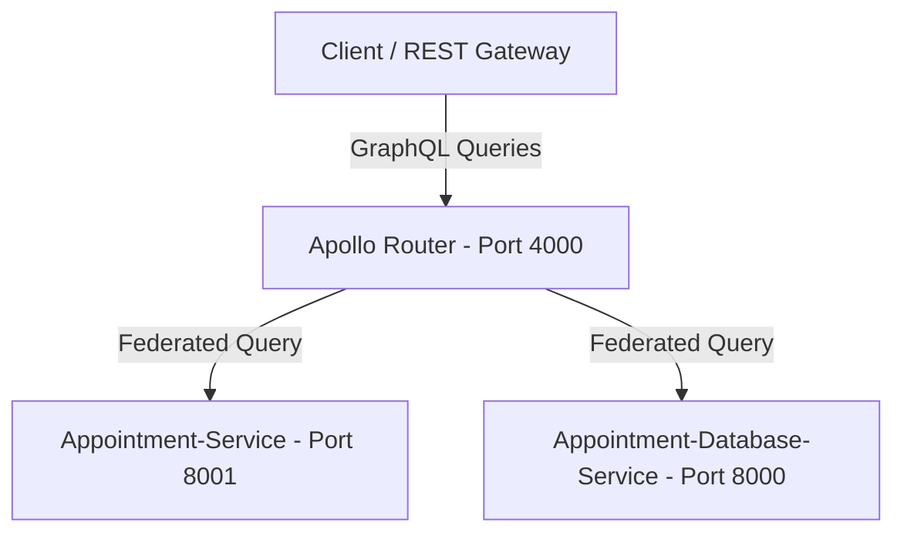

# GraphQL Datagraph (Federated Gateway)

This repository serves as the central **GraphQL Schema Registry and Gateway** for our federated microservices architecture. It configures and runs the **Apollo Router** as our high-performance GraphQL federated gateway, bringing together our subgraphs into a unified data graph.

---

## 🚀 Repository Architecture

The gateway is built on top of the native **Apollo Router** image, which federates requests across multiple underlying service instances:



---

## 📂 File Directory & Purpose

| File / Folder | Purpose |
| :--- | :--- |
| [`supergraph.graphql`](file:///c:/Users/Admin/Desktop/api-graphql-automation/graphql-datagraph/supergraph.graphql) | The compiled, federated GraphQL schema containing routing maps and definitions for all subgraphs. |
| [`supergraph.yaml`](file:///c:/Users/Admin/Desktop/api-graphql-automation/graphql-datagraph/supergraph.yaml) | Configuration spec for Apollo Rover detailing subgraph names and routing URLs. |
| [`router.yaml`](file:///c:/Users/Admin/Desktop/api-graphql-automation/graphql-datagraph/router.yaml) | Configuration for Apollo Router (listen ports, CORS, health checks). |
| [`compose.py`](file:///c:/Users/Admin/Desktop/api-graphql-automation/graphql-datagraph/compose.py) | Python schema exporter and Rover composition orchestration script. |
| [`appointment-service.graphql`](file:///c:/Users/Admin/Desktop/api-graphql-automation/graphql-datagraph/appointment-service.graphql) | Generated schema for the high-level Appointment business logic subgraph. |
| [`appointment-db-service.graphql`](file:///c:/Users/Admin/Desktop/api-graphql-automation/graphql-datagraph/appointment-db-service.graphql) | Generated schema for the low-level database interaction subgraph. |
| [`docker-compose.yml`](file:///c:/Users/Admin/Desktop/api-graphql-automation/graphql-datagraph/docker-compose.yml) | Local multi-container Docker composition that boots all services and networks. |
| [`Dockerfile`](file:///c:/Users/Admin/Desktop/api-graphql-automation/graphql-datagraph/Dockerfile) | Configures a custom Apollo Router build embedded with the compiled `supergraph.graphql`. |

---

## 🛠️ Schema Composition & Automation

To update the unified graph when resolving new schemas, run the python compiler script:

```bash
python compose.py
```

### How `compose.py` Works:
1. **Introspection**: It dynamically imports the schemas from sibling service folders (`Appointment-Service` and `Appointment-Database-Service`) and dumps them to local `.graphql` files.
2. **Federation Composition**: It invokes the **Apollo Rover CLI** to compile these files into a unified `supergraph.graphql`.
3. **Application Control Policy Fallback**: 
   If running on a Windows system where corporate security policies (AppLocker or WDAC) block execution of unsigned native `.exe` binaries, the script **automatically catches the block** and delegates execution to your local **WSL Ubuntu environment**, ensuring compilation always succeeds.

---

## 🐳 Docker Deployment

The gateway can be orchestrated alongside the REST API Gateway and microservices using Docker Compose.

### Build and Start All Services:
From the root of this repository, run:
```bash
docker-compose up --build
```

This starts four services in parallel:
* **`appointment-db-service`** on port `8000` (FastAPI GraphQL)
* **`appointment-service`** on port `8001` (FastAPI GraphQL)
* **`graphql-datagraph`** on port `4000` (Apollo Router Gateway)
* **`rest-api-gateway`** on port `8080` (FastAPI REST Gateway)

### Port Mappings
* **Apollo Router Gateway**: [http://localhost:4000/](http://localhost:4000/)
* **Health Check**: [http://localhost:8088/health](http://localhost:8088/health)
